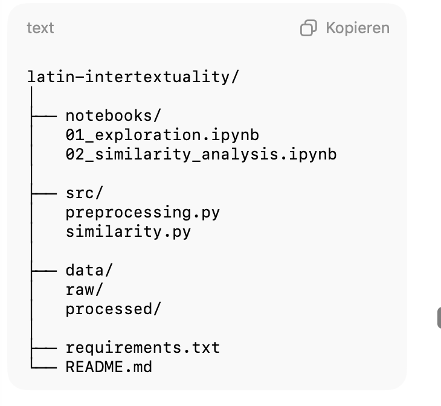

# Doku Git & Positron

[Dokumentation](https://positron.posit.co/git.html)

# Anleitung nach ChatGPT

Für euer Projekt (Intertextualität in lateinischen Briefen analysieren) ist wichtig, dass ihr explorativ arbeiten könnt, Ergebnisse nachvollziehbar bleiben und ihr trotzdem sauber kollaboriert. In der Digital Humanities wird dafür häufig eine Kombination aus Notebooks + Git + etwas modularisiertem Python-Code genutzt.

Ich würde euch folgenden Workflow empfehlen.

⸻

1.  Grundidee des Workflows

Die beste Kombination für euch ist wahrscheinlich: • Repository auf GitHub • Entwicklung hauptsächlich in Jupyter Notebook oder JupyterLab • Bearbeitung lokal oder über Google Colab • Wiederverwendbaren Code langsam in .py Dateien auslagern

So könnt ihr mit Notebooks arbeiten (was ihr kennt) und gleichzeitig professionelle Projektstruktur lernen.

Dieser hybride Workflow ist in vielen Data-Science- und Digital-Humanities-Projekten Standard (vgl. Knaflic 2019; VanderPlas 2016).

{width="309"}

Idee:

• notebooks/ → Analyse und Visualisierung

• src/ → Funktionen, die ihr öfter braucht

• data/ → Textkorpus

Das verhindert, dass ein Notebook schnell tausende Zeilen Code enthält.

⸻

3.  Typischer Arbeitsablauf

4.  Änderungen holen

``` bash
git pull
```

2.  Notebook bearbeiten

z.B.

```         
notebooks/02_similarity_analysis.ipynb
```

3.  Code auslagern

Wenn eine Funktion wichtig wird:

```{python}
# src/similarity.py

def cosine_similarity(vec1, vec2): 
    ...
```

Im Notebook:

```{python}
from src.similarity import cosine_similarity
```

4.  Änderungen committen

```{bash}
git add . 
git commit -m "Add intertext similarity analysis"
git push
```

⸻

4.  Wichtiges Problem bei Notebooks

.ipynb Dateien enthalten auch Output und Metadaten, wodurch viele unnötige Änderungen entstehen.

Lösung: Tool

nbstripout

Installation:

```{bash}
pip install nbstripout
nbstripout --install
```

Dann werden Notebook-Outputs automatisch entfernt.

⸻

5.  Wenn ihr möglichst wenig Setup wollt

Dann ist dieser Workflow ideal: 1. Repository auf GitHub 2. Notebooks dort speichern 3. Notebook direkt in Google Colab öffnen 4. Änderungen zurück ins Repository speichern

Das funktioniert erstaunlich gut für kleine Teams.

⸻

6.  Nützliche Python-Libraries für euer Projekt

Für Intertextualität / Textähnlichkeit:

• NLTK

• spaCy

• scikit-learn

• gensim

Typische Methoden:

• n-grams

• TF-IDF

• cosine similarity

• word embeddings

Diese Methoden werden auch in der Literaturwissenschaft zunehmend genutzt (Jockers 2013; Underwood 2019).

⸻

7.  Gute Tutorials speziell für euren Fall

Python / Data Science mit Notebooks

Sehr guter Einstieg:

• Python Data Science Handbook – Jake VanderPlas

Online kostenlos: https://jakevdp.github.io/PythonDataScienceHandbook/

⸻

Textanalyse / NLP

Sehr gutes Tutorial:

• Natural Language Processing with Python – Steven Bird, Ewan Klein, Edward Loper

Online frei verfügbar: https://www.nltk.org/book/

⸻

Git für Wissenschaftsprojekte

• Software Carpentry Git Tutorial

https://swcarpentry.github.io/git-novice/

Sehr verbreitet an Universitäten.

⸻

8.  Empfehlung für euer konkretes Projekt

Ich würde euch diesen Workflow empfehlen:

1\. Repository auf GitHub

2\. Arbeit in Jupyter Notebooks

3\. Code schrittweise in src/\*.py auslagern 4. Daten getrennt speichern

5\. Notebook-Outputs automatisch entfernen

Das ist:

• einfach genug für Anfänger

• aber nah an professionellen Forschungsworkflows

⸻

✅ Kurz gesagt

Für euer Projekt ist der beste Workflow:

GitHub + Jupyter Notebooks + kleine .py Module

Nicht:

• nur Colab

• nicht nur ein riesiges Notebook.